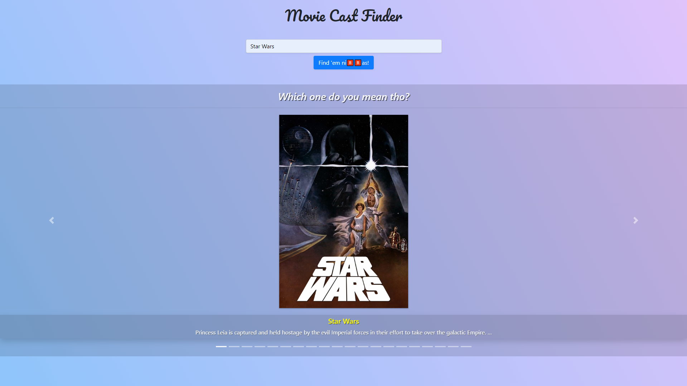
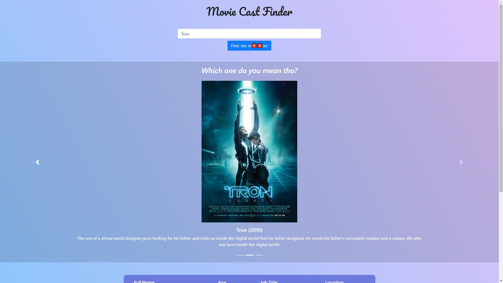
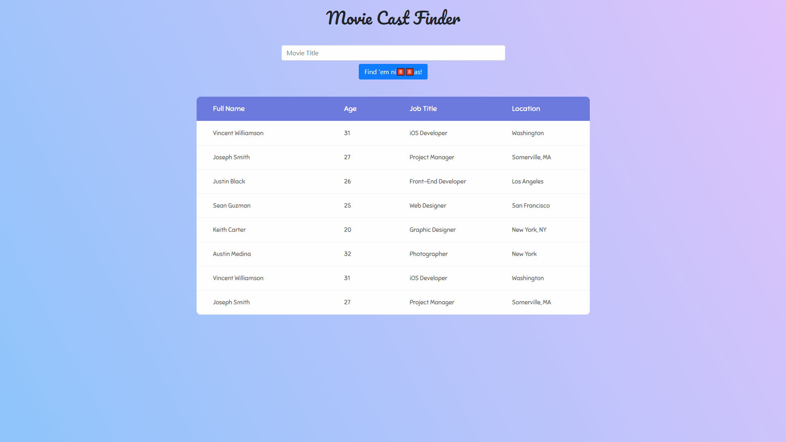

# Movie Cast Finder
> A lightweight VanillaJS and Bootstrap movie cast search interface

This is a personal application intended mainly as a modern JS workout. No tutorials were used. 💯 Trying to up my game at promises, async await, classes, ES6 Modules - import/export, Webpack, SASS etc.

## Usage example

This is a search interface for movie casts using [The Movie Database API](https://www.themoviedb.org/).
You can search a movie by it's name and then choose from a list of movies which match with that name, after choosing one of the movies a list of cast members will be shown alongside their pictures, you're able to find out more information about specific cast members by clicking on an actor from the list.

<!-- !!!! Reminder to include their social medias on their info as well !!!! -->
<!-- !!!! Reminder on table hover to open the line up and render the actor's photo !!!!  -->

<!-- _For more examples and usage, please refer to the [Docs][docs]._ - soon -->

## Built With

* Vanilla JS / ES8+
* [SASS](https://sass-lang.com/) - CSS Supercharger
* [Bootstrap](https://getbootstrap.com/) - The CSS Framework used
* [Bootstrap Native](https://github.com/thednp/bootstrap.native) - Vanilla JS code for Bootstrap
* [WebPack](https://www.npmjs.com/package/webpack) - Module Bundler used
* [The Movie Database API](https://www.themoviedb.org/) - Database used for queries

## Inspirations and resources

* [Colorlib's Responsive Table v2](https://colorlib.com/wp/template/responsive-table-v2/) - Table Design
* [Animista](http://animista.net/play/background/bg-pan/bg-pan-left) - Background Keyframes CSS
* [Wave text animation](https://codepen.io/molefrog/pen/ieJbo) - Inspiration, keyframes and CSS logic for the page title

## Release History

* 0.3.0
    * Greatly improved CSS and layout/HTML structure.
    * Added transitions.
  
    

* 0.2.0
    * Carousel Draft.
    * Initial carousel layout done.
    * Migrated to Bootstrap v4 CSS + Bootstrap Native JS.
  
    

* 0.1.0
    * Intial Draft.
    * Table Draft.
    * Intial layout and structure almost there.
    * Colors and theme kinda figured out already.
  
    

## Help resources used

#### How to use the API
[The Movie Database API](https://developers.themoviedb.org/3/getting-started/introduction)

#### Webpack

[How to add favicon to /dist?](https://github.com/coryhouse/react-slingshot/issues/128)

#### Stack Overflow (For future references)
[Fetch with classes](https://stackoverflow.com/a/39395072/10088643)

[Is it a bad practice to have a constructor return a promise?](https://stackoverflow.com/questions/24398699/is-it-bad-practice-to-have-a-constructor-function-return-a-promise)

[How to do async await on a forEach function](https://stackoverflow.com/questions/50328143/how-to-do-async-await-on-a-foreach-function)

[Using async/await with a forEach loop](https://stackoverflow.com/questions/37576685/using-async-await-with-a-foreach-loop)

[CSS transition auto height not working](https://stackoverflow.com/a/17260384/10088643)

## Meta

Gustavo Máximo – gfmaximo97@gmail.com

<!-- Distributed under the XYZ license. See ``LICENSE`` for more information.

[https://github.com/yourname/github-link](https://github.com/dbader/) - soon -->

## Contributing

I'm not currently accepting pull requests as this is a personal project for training purposes.
Feel free to fork it however.

<!-- 1. Fork it (<https://github.com/GoldenMaximo/movie-cast-finder/fork>)
2. Create your feature branch (`git checkout -b feature/fooBar`)
3. Commit your changes (`git commit -am 'Add some fooBar'`)
4. Push to the branch (`git push origin feature/fooBar`)
5. Create a new Pull Request -->

<!-- Markdown link & img dfn's - soon -->
<!-- [npm-image]: https://img.shields.io/npm/v/datadog-metrics.svg?style=flat-square
[npm-url]: https://npmjs.org/package/datadog-metrics
[npm-downloads]: https://img.shields.io/npm/dm/datadog-metrics.svg?style=flat-square
[travis-image]: https://img.shields.io/travis/dbader/node-datadog-metrics/master.svg?style=flat-square
[travis-url]: https://travis-ci.org/dbader/node-datadog-metrics
[wiki]: https://github.com/yourname/yourproject/wiki - soon -->
